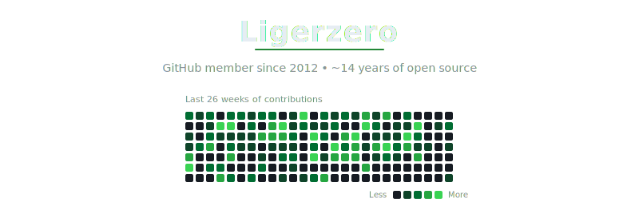
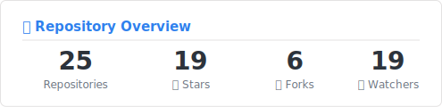

  

## Hi there 👋

**Pronouns:** he/him/his

> 🔍 **Actively seeking employment** — Senior Software Engineer with 12 years of experience. Open to full-time opportunities.

---

## 🚀 Recent Projects

| Project | Description | Language |
|---------|-------------|----------|
| [fastify-template-mongo](https://github.com/ligerzero459/fastify-template-mongo) | Template for a Fastify web server with MongoDB via Mongoose | JavaScript |
| [fastify-template-postgres](https://github.com/ligerzero459/fastify-template-postgres) | Template for a Fastify web server with a PostgreSQL connection | JavaScript |
| [install-all](https://github.com/ligerzero459/install-all) | Recursively installs npm packages in all subdirectories containing a `package.json` | JavaScript |
| [resume-terminal-site-template](https://github.com/ligerzero459/resume-terminal-site-template) | A terminal-style resume website built with React, TypeScript, and Vite | TypeScript |
| [web-service-template](https://github.com/ligerzero459/web-service-template) | LLM-assisted user service starter using TypeScript, PostgreSQL, and Redis | TypeScript |

---

## 📊 GitHub Stats

  

  
  

---

## 🔥 Activity

  

  

